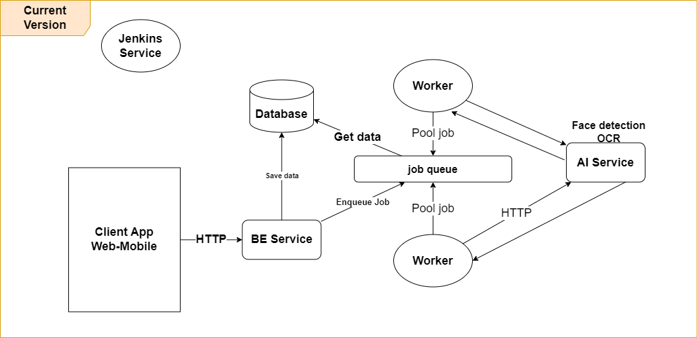
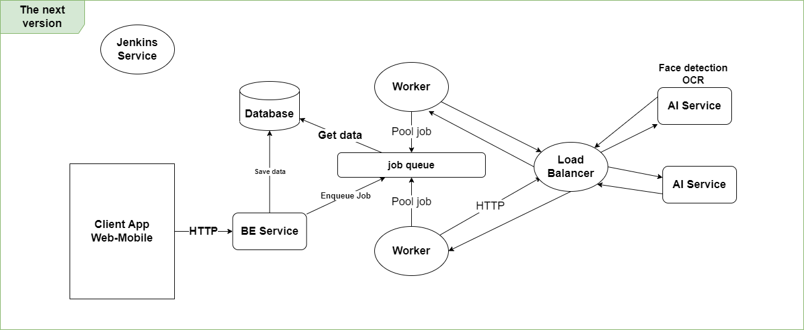

# 19N12 - TEAM 1 - Events: Picture Finders

## Video demo
Use this link: [https://youtu.be/_8mVyfxF-9o](https://youtu.be/_8mVyfxF-9o)

## More information
More information of project: [Link document](https://docs.google.com/document/d/1MbT5B7fmlTc-TBTIIkfts7OVd-rrcYt-_b2BFACHJXk/edit?usp=share_link)

## Architecture

* **Current version**


* **The next version**


## Prepare

- Create a `.env` file from the `.env.example` file

  ```
  cp .env.example .env
  ```

- Install package

  ```
  npm install
  ```

- Build source

  ```
  npm run build
  ```

## Local (For DEV)

- Environment

  ```
  node v16+
  ```

- Docker commands

  - Build & run all container

    ```
    docker-compose up --build
    ```

  - Run all container
    ```
    docker-compose up
    ```
  - Run a container
    ```
    docker-compose up <service_name>
    ```
  - Exec

    ```
    docker exec -it <service_name> sh
    ```

## Migration

- Generate migration file with Windows (Linux, MAC change % in line 16 file package.json to $)

  ```
  npm run migration:generate --name=<file-name>
  ```

- Running migration

  ```
  npm run migration:run
  ```

- Revert migration

  ```
  npm run migration:revert
  ```

# Convention

- [Git Branch Convention](./docs/git-branch-convention.md)
- [Code Convention](./docs/code-convention.md)

# Architect

- [Project Structure](./docs/project-structure.md)
